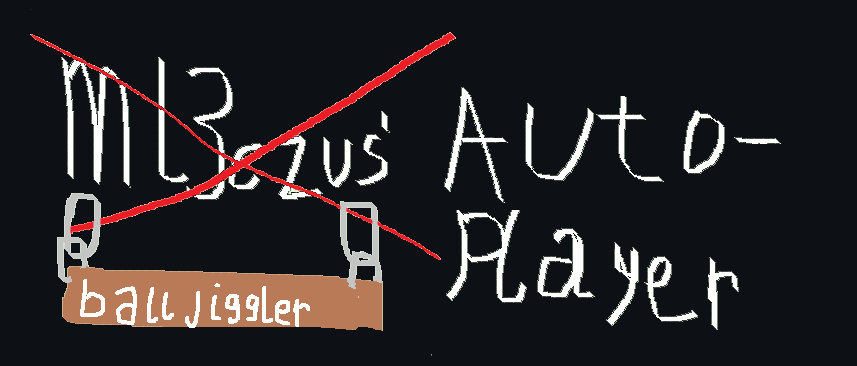

<p align='center'></p>

<p align='center'>
  <strong>The macOS port.<br>
  Same sheets, same notation, now with an Accessibility prompt instead of a driver.</strong>
</p>

***

<!--
  The friend's original README has live shields.io badges wired up to their
  repo/releases/Discord. Swap YOUR_USERNAME/YOUR_REPO below (and add a
  Discord link if you make one) once this is pushed, then delete this comment.
-->
<p align='center'>
  <a href='https://github.com/YOUR_USERNAME/YOUR_REPO/releases/latest'></a>
  <a href='https://github.com/YOUR_USERNAME/YOUR_REPO/releases/'></a>
  <a href='https://github.com/YOUR_USERNAME/YOUR_REPO/issues'></a>
  
</p>
<p align='center'>
  &nbsp;
  &nbsp;
</p>

## What this is

A macOS port of [ml3czus' Auto-player](https://github.com/goog-company/ml3czus-autoplayer) — same
piano/guitar sheet notation, same idea (paste a sheet, hit play, it types the notes into Roblox
for you), rebuilt on Electron since the original's AHK core is Windows-only.

## Documentation

- Sheets use the same notation as the original: `[abc]` is a chord (keys sent together), `-` is a
  short rest, `|`/`/`/`\` is a longer rest, and any other character is a single note.
- `Key delay` and `Pause delay` can be set inside the sheet itself (e.g. `# Key delay: 40`,
  `# Pause delay: 100`), or overridden from the app's Options menu.
- Keystrokes are sent via macOS's built-in `System Events` automation — no separate driver to
  install, but it does mean the app needs Accessibility permission (see below).

## One-time setup

1. Install [Node.js](https://nodejs.org) (LTS) if you don't have it.
2. In this folder:
   ```
   npm install
   npm start
   ```
3. The first time it sends a keystroke, macOS will prompt for Accessibility permission. Grant it
   to whatever's asking (Terminal, or "Electron" in dev mode). If you miss the prompt:
   `System Settings → Privacy & Security → Accessibility` → enable it manually (add it with `+` if
   it's not listed). You'll need to redo this once for a packaged `.app`, since that's a separate
   binary from Electron's dev build.

## Using it

1. Open Roblox and get into the game/instrument.
2. Paste a sheet into the box, or load a `.txt` file from the File menu.
3. **F4** plays, **F6** pauses/resumes, **F7** stops — global hotkeys, so they work even while
   Roblox is focused. Hold F6/F7 down briefly rather than tapping; a fast tap can occasionally get
   swallowed by macOS before it reaches the app.
4. Tab away from Roblox (or open chat) mid-song and playback auto-pauses, resuming once Roblox is
   focused again.

## Download

Auto-player is in the Releases tab, source is in the Code tab. If your AV flags it, it's not
malicious — it's just an unsigned Electron app poking `System Events`, which understandably looks
suspicious to a scanner that's never seen it before.

## Credit

Original Windows version: [ml3czus](https://github.com/goog-company/ml3czus-autoplayer). Banner
art: my friend, who is built different.
